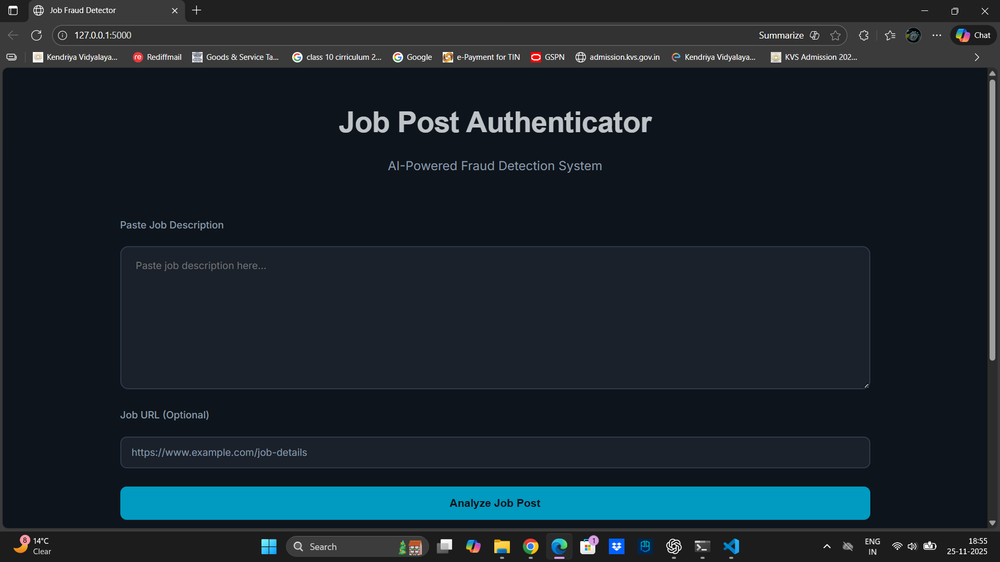

# 🛡️ Job Post Authenticator

Job Post Authenticator is an **AI-powered web application** designed to detect and classify **fraudulent job postings**. Using **Deep Learning (LSTM)** and **NLP techniques**, the system analyzes job descriptions or job URLs and predicts whether the post is **Legitimate** or **Fraudulent**, helping users avoid scam and fake employment advertisements.

---

## 🖥️ Application UI Preview



---

## 🚀 Project Overview

With the increasing number of online job scams and fake recruitment agencies, job seekers are at risk of financial and personal data loss. This project leverages machine learning to verify job posting authenticity and provide a secure job discovery experience.

Users can:
- Paste a job description
- OR provide a job posting URL (auto-scraping enabled)
- Receive an instant AI-based fraud prediction score

---

## ✨ Key Features

- 📝 **Paste Job Description** manually
- 🌐 **Analyze Job URL** — automatic text extraction
- 🤖 **LSTM-based classification model**
- 📊 **Prediction score** showing risk probability
- ⚡ **Real-time analysis via Flask backend**
- 🎨 Modern and responsive web UI
- 🔐 Helps prevent online employment scams

---

## 🧠 Machine Learning & NLP Workflow

### ✔ Data Preprocessing
- Cleaning, tokenization, padding
- Text normalization and sequence extraction
- Handling class imbalance

### ✔ Model Architecture
- Embedding layer
- LSTM sequence learning
- Dense + Dropout layers
- Sigmoid binary output

### ✔ Evaluation Metrics
- Accuracy
- Precision, Recall, F1-score
- Classification report

---

## 🧰 Technologies Used

| Category | Tools |
|----------|-------|
| Programming | Python |
| Frontend | HTML, CSS, JavaScript |
| Backend | Flask |
| ML / DL | TensorFlow, Keras |
| NLP | Tokenizer, Padding |
| Web Scraping | Requests, BeautifulSoup |
| Deployment | Local / Cloud Ready |

---

## 📂 Folder Structure
```

├── app.py                       # Flask backend with prediction & scraping
├── Model_Training.ipynb         # Notebook for training the LSTM model
├── fake_job_lstm_model.h5       # Trained model file
├── tokenizer.pkl                # Tokenizer for text conversion
├── fake_job_postings.csv        # Dataset
├── requirements.txt             # Dependencies
│
├── assets/
│ └── screenshot.png             # UI screenshot
│
├── static/
│ └── styles.css                 # Frontend styling
│
└── templates/
└── index.html                   # Main UI layout

```

---

## ⚙️ Installation Guide

### 1️⃣ Clone the Repository
```bash
git clone https://github.com/<your-username>/Job-Post-Authenticator.git
cd Job-Post-Authenticator 
```

### 2️⃣ Create Virtual Environment
```bash
python -m venv myenv
myenv\Scripts\activate        # Windows
source myenv/bin/activate     # Linux/Mac
```

### 3️⃣ Install Dependencies
```bash
pip install -r requirements.txt
```

### 4️⃣ Run Application
```bash 
python app.py
```

Open in browser:
http://127.0.0.1:5000/

# 🔮 Future Enhancements

#### Chrome browser extension for job verification

#### API integration for LinkedIn / Naukri / Indeed

#### Detailed explanation with SHAP/LIME

#### Upgrade model to BERT / Transformer architecture

#### Job risk analysis dashboard

# 👨‍💻 Contributor

### Palwinder Singh

### Contributions and improvements are welcome!